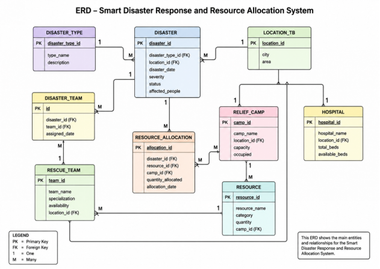

#  Smart Disaster Response & Resource Allocation System

A relational database built in **SQL Server** to manage disasters, affected areas, relief resources and their allocation to response teams.

## Overview
During a disaster, relief resources such as food, water, medicine and shelter need to reach the right places quickly. This database stores disaster, area, resource and team data in one place, and uses SQL logic to track and automate how resources are allocated.

##  Database Design

- Normalized relational schema
- Primary keys, foreign keys and constraints to keep data consistent

##  Features
- **CRUD operations** – insert, update, delete and view records
- **Joins** – combine disaster, area, resource and team data for reports
- **Stored Procedures** – reusable logic for common operations
- **Triggers** – automatic actions when data changes (e.g. updating resource stock after an allocation)

##  Tech Stack
- Microsoft SQL Server
- T-SQL

## Documentation
Full project report: [IQRA DBMS LAB PROJECT FINAL.pdf](IQRA DBMS LAB PROJECT FINAL.pdf)

##  Author
**Iqra** – BS Computer Science, Iqra University, Karachi
[LinkedIn](https://www.linkedin.com/in/iqra-sattar-78a47143a)
